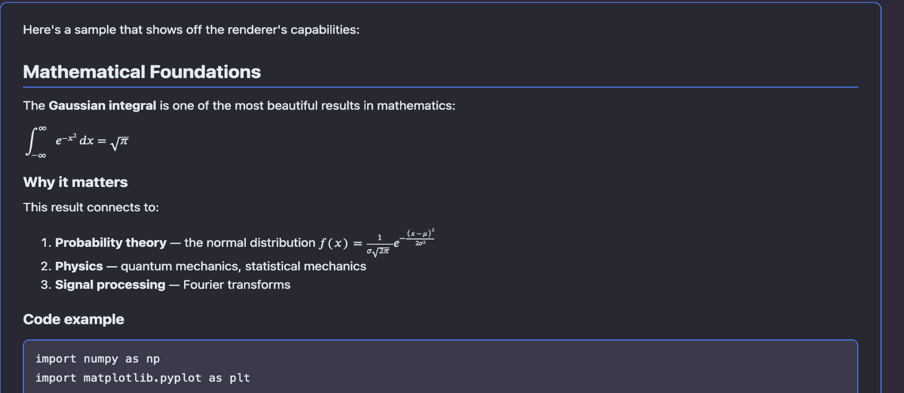
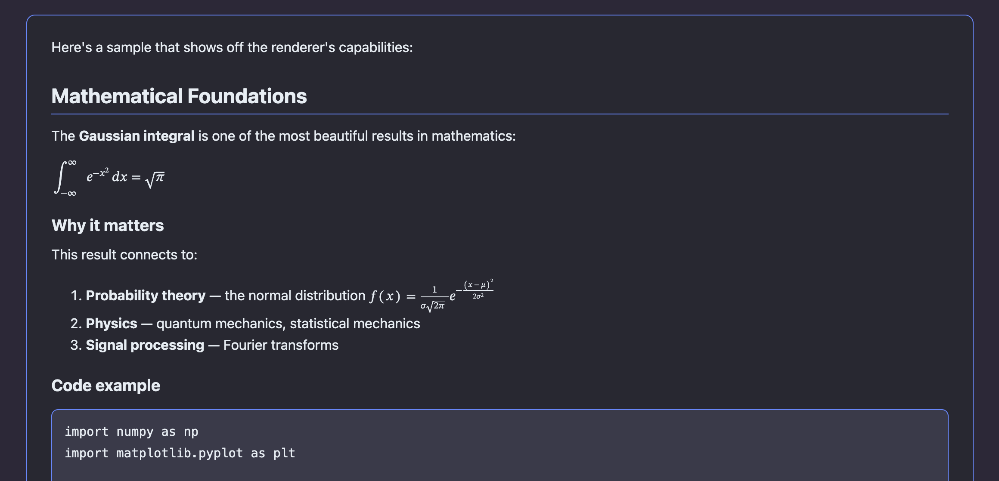
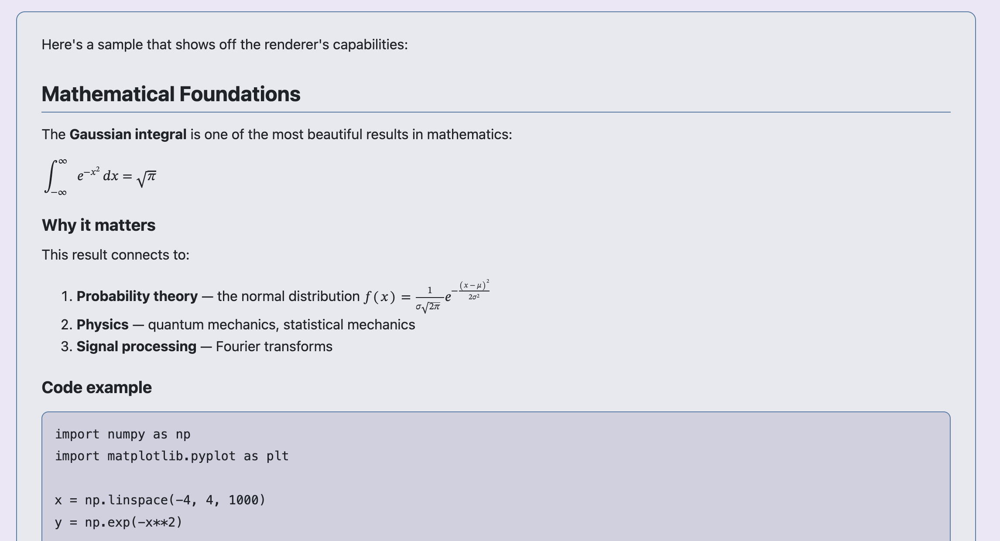

# pi-markdown-preview

Rendered markdown and LaTeX preview for [pi](https://github.com/badlogic/pi-mono). Preview assistant responses or arbitrary markdown files directly in your terminal or browser, with full math rendering, syntax highlighting, and theme-aware styling.

## Screenshots

**Dark theme — terminal inline preview:**



**Light theme — terminal inline preview:**


**Browser preview (dark / light):**

<p float="left">
  
  
</p>

## Features

- **Terminal preview** — renders markdown as PNG images displayed inline (Kitty, iTerm2, Ghostty, WezTerm)
- **Browser preview** — opens rendered HTML in your default browser
- **LaTeX/math support** — renders `$inline$` and `$$display$$` math via MathML
- **Theme-aware** — matches your pi theme (dark/light, accent colours)
- **Multi-page** — long responses are split into navigable pages
- **Response picker** — select any past assistant response to preview, not just the latest
- **File preview** — preview arbitrary `.md` files from the filesystem
- **Caching** — rendered pages are cached for instant re-display

## Prerequisites

- A Chromium-based browser (Chrome, Brave, Edge, Chromium)
- [Pandoc](https://pandoc.org/installing.html) (`brew install pandoc` on macOS)
- A terminal with image support (Ghostty, Kitty, iTerm2, WezTerm) for inline preview

## Install

```bash
pi install https://github.com/omaclaren/pi-markdown-preview
```

Or try it without installing:

```bash
pi -e https://github.com/omaclaren/pi-markdown-preview
```

## Usage

| Command | Description |
|---------|-------------|
| `/preview` | Preview the latest assistant response in terminal |
| `/preview --pick` | Select from all assistant responses |
| `/preview README.md` | Preview a markdown file |
| `/preview --file ./docs/guide.md` | Preview a file (explicit flag) |
| `/preview --browser` | Open preview in default browser |
| `/preview --pick --browser` | Pick a response, open in browser |

### Keyboard shortcuts (terminal preview)

| Key | Action |
|-----|--------|
| `←` / `→` | Navigate pages |
| `r` | Refresh (re-render with current theme) |
| `o` | Open current preview in browser |
| `Esc` | Close preview |

## Configuration

Set `PANDOC_PATH` if pandoc is not on your `PATH`:

```bash
export PANDOC_PATH=/usr/local/bin/pandoc
```

Set `PUPPETEER_EXECUTABLE_PATH` to override browser detection:

```bash
export PUPPETEER_EXECUTABLE_PATH=/path/to/chromium
```

## Cache

Rendered previews are cached at `~/.pi/cache/markdown-preview/`. Clear with:

```bash
rm -rf ~/.pi/cache/markdown-preview/
```

## License

MIT
