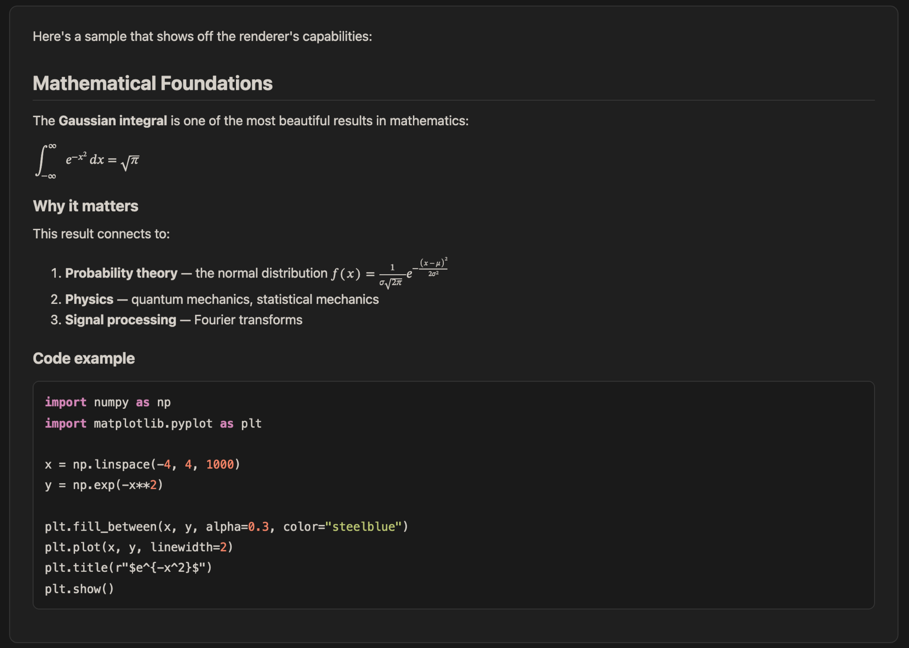

# pi-markdown-preview

> **Personal fork** of [omaclaren/pi-markdown-preview](https://github.com/omaclaren/pi-markdown-preview) v0.10.0. Not intended for public use.
>
> Fork changes: browser previews default to light, `--theme` controls browser and artifact themes, Chromium-based PDF saving, local MathJax assets, and optional CJK-aware LaTeX output.

Preview assistant responses and local Markdown, LaTeX, code, diff, and other text-based files from [pi](https://pi.dev) in the terminal, browser, or as PDF, with math rendering, syntax highlighting, Mermaid, and theme-aware styling.

## Screenshots

Preview adapts to your pi theme. Examples with a custom theme and the built-in defaults:

**Terminal preview (custom theme):**



**Terminal preview (default dark):**


**Terminal preview (default light):**


**Browser preview (default dark and light):**

<p float="left">
  
  
</p>

## Features

- **Terminal preview (default)** — renders markdown as PNG images displayed inline (Kitty, iTerm2, Ghostty, WezTerm). Long responses are automatically split across navigable pages.
- **Browser preview** — opens rendered HTML in your default browser as a single continuous scrollable document. Defaults to light; use `--theme dark` or `--theme auto` to override it.
- **PDF export via LaTeX** — `/preview --pdf` and `/preview-pdf` export through Pandoc plus LaTeX and open the result.
- **PDF save via Chromium** — `/preview-pdf-save` writes a browser-rendered PDF without requiring LaTeX, with theme and destination controls.
- **LLM-callable artifact export** — lets pi render the latest response, supplied Markdown/LaTeX, or a local file to PDF, HTML, or PNG files for remote/headless workflows such as Telegram delivery.
- **Mermaid diagrams** — renders ` ```mermaid` code blocks as SVG diagrams in terminal/browser previews, and as high-quality vector diagrams in PDF export when Mermaid CLI is available.
- **LaTeX/math support** — renders `$inline$`, `$$display$$`, `\(...\)`, and `\[...\]` math with the local `mathjax` dependency for browser-based previews, embeds MathJax SVG support into exported HTML, or uses native LaTeX for LaTeX PDF export.
- **CJK-aware LaTeX output** — uses `ctex` and an available CJK sans-serif font when installed, while preserving the smaller-install fallback.
- **Syntax highlighting** — fenced code blocks in markdown and standalone code files are rendered with theme-aware syntax colouring via pandoc. Supports 50+ languages including TypeScript, Python, Rust, Go, C/C++, Julia, and more.
- **Annotation marker highlighting** — inline `[an: ...]` markers are highlighted in terminal/browser/PDF previews as note-only chips (`...`, without the `[an: ]` wrapper) outside code blocks; long notes wrap correctly in PDF instead of running off the page
- **Theme-aware** — terminal previews and PNG artifacts follow pi by default; browser previews and HTML artifacts default to light; explicit light, dark, and auto modes are available.
- **Response picker** — select any past assistant response to preview, not just the latest
- **File preview** — preview arbitrary Markdown files (including `.md`, `.mdx`, `.rmd`, `.qmd`), LaTeX `.tex` files, diff/patch files, or code files (`.py`, `.ts`, `.js`, `.rs`, etc.) from the filesystem. LaTeX files are rendered as documents with full math and sectioning; diff files are rendered with coloured add/remove lines; code files are rendered with syntax highlighting.
- **Caching** — rendered pages are cached for instant re-display; refresh (`r`) bypasses cache

## Prerequisites

- [Pandoc](https://pandoc.org/installing.html) (`brew install pandoc` on macOS)
- For terminal preview (`/preview` default): a Chromium-based browser executable (Chrome, Brave, Edge, Chromium). `puppeteer-core` is included as an extension dependency; no separate Puppeteer install is needed.
- For terminal inline display: a terminal with image support (Ghostty, Kitty, iTerm2, WezTerm)
- For PDF export (optional): a LaTeX engine, e.g. [TeX Live](https://tug.org/texlive/) (`brew install --cask mactex` on macOS, `apt install texlive` on Linux)
- For Mermaid-in-PDF support (optional): Mermaid CLI (`npm install -g @mermaid-js/mermaid-cli`) and a Chromium browser accessible to Mermaid CLI

## Install

```bash
pi install git:github.com/SleeperXZY/pi-markdown-preview
```

Pi installs the runtime dependencies (`puppeteer-core` and `mathjax`) automatically. The checkout is stored at:

```text
~/.pi/agent/git/github.com/SleeperXZY/pi-markdown-preview/
```

Update the installed fork with:

```bash
pi update --extensions
```

## Usage

| Command | Description |
|---------|-------------|
| `/preview` | Preview the latest assistant response in terminal |
| `/preview --pick` | Select from all assistant responses |
| `/preview <path/to/file>` | Preview a Markdown, LaTeX, diff, or code file |
| `/preview --file <path/to/file>` | Preview a file (explicit flag) |
| `/preview --browser` | Open preview in default browser using the light theme |
| `/preview --browser --theme dark` | Open browser preview with the dark theme |
| `/preview --font-size 14` | Preview with a custom terminal/browser font size in px (defaults: terminal 16, browser 15) |
| `/preview-browser` | Shortcut for browser preview |
| `/preview-browser <path/to/file>` | Open a file preview in browser |
| `/preview --pdf` | Export through LaTeX and open |
| `/preview-pdf` | Shortcut for `--pdf` |
| `/preview --pdf <path/to/file>` | Export a file through LaTeX |
| `/preview-pdf-save` | Save a light-themed PDF through Chromium without opening it |
| `/preview-pdf-save --theme dark file.md` | Save a dark browser-rendered PDF |
| `/preview-clear-cache` | Clear rendered preview cache |
| `/preview --pick --browser` | Pick a response, open in browser |

Local images are supported. File previews resolve relative image paths against the previewed file’s directory; assistant-response previews resolve them against pi’s current working directory. Absolute paths, `file:`, `http(s):`, and `data:` image URLs also work.

### LLM-callable artifact export

The extension also registers a `preview_export` tool that pi can call directly. It renders Markdown/LaTeX content, a local file, or the latest assistant response to artifact files and returns their paths instead of requiring an interactive terminal/browser preview.

Supported formats:
- `pdf` — writes a PDF file using the same pandoc + LaTeX path as `/preview-pdf`
- `html` — writes a rendered HTML document with the local MathJax SVG bundle embedded; Mermaid diagrams still require network access when the document is opened
- `png` — writes one PNG per rendered preview page, appending `-1-of-N`, `-2-of-N`, etc. for multi-page output

The tool accepts optional `outputPath`, `fontSizePx`, `resourcePath`, `theme`, and `open` arguments. HTML artifacts default to light, while PNG artifacts default to `auto` and follow pi's current theme. `theme` accepts `light`, `dark`, or `auto` and does not affect LaTeX PDF output. By default the tool only writes files and returns paths, so another integration (for example Telegram or an upload/send-file tool) can deliver them.

Example user requests pi can satisfy with `preview_export`:

```text
Make the last answer a PDF and send it to me.
Render ./report.md as HTML.
Export this markdown as PNG pages.
```

### Programmatic helper exports

Other pi extensions can import the preview helpers directly:

```ts
import {
  openPreview,
  openPreviewInBrowser,
  closeSharedPreviewBrowser,
} from "pi-markdown-preview";
```

- `openPreview(ctx, markdownOverride?, resourcePath?, isLatex?, fontSizePx?)` opens the inline terminal preview.
- `openPreviewInBrowser(ctx, markdownOverride?, resourcePath?, isLatex?, fontSizePx?, requestedTheme?)` writes and opens the browser HTML preview. `requestedTheme` accepts `light`, `dark`, or `auto` and defaults to light.
- `closeSharedPreviewBrowser()` closes the shared headless Chromium instance used for terminal/PNG rendering and Chromium PDF saving. Importing extensions can call this from their own `session_shutdown` handler; the bundled extension also calls it on pi shutdown/reload/switch.

Additional accepted argument aliases:
- Pick: `-p`, `pick`
- File: `-f`
- Browser target: `browser`, `--external`, `external`, `--browser-native`, `native`
- PDF target: `pdf`
- Terminal target: `terminal`, `--terminal` (usually unnecessary because terminal is the default)
- Font size: `--font-size <px>`, `--font-size=<px>`, `--font-size-px <px>`, `--fs <px>` (10–24 px; terminal/browser previews; defaults: terminal 16, browser 15)
- Theme: `--theme light|dark|auto` (browser preview and `/preview-pdf-save`; defaults to light; `auto` follows pi theme inference)
- Output path: `--out <path>` (`/preview-pdf-save` only)
- Output directory: `--out-dir <dir>` (`/preview-pdf-save` only; default: `./.pi-markdown-preview`)
- Help: `--help`, `-h`, `help`
- Note: `--pick` and `--file` cannot be used together; `--out` and `--out-dir` cannot be combined

LaTeX PDF export uses Pandoc plus a LaTeX PDF engine (`xelatex` by default). The PDF preamble uses optional styling packages when available, including `ctex` and CJK font selection, light code-block backgrounds via `framed`, and simpler fallbacks otherwise. Long-running PDF subprocesses time out after 120 seconds by default; set `PI_MARKDOWN_PREVIEW_PDF_TIMEOUT_MS` to adjust this.

Run the static, registration, and type checks with:

```bash
npm run check
```

Run real HTML, PNG, LaTeX PDF, and Chromium PDF rendering checks with:

```bash
npm run test:smoke
```

The smoke suite requires Pandoc, `xelatex`, and a detected Chromium-based browser.

### Keyboard shortcuts (terminal preview)

| Key | Action |
|-----|--------|
| `←` / `→` | Navigate pages |
| `r` | Refresh (re-render with current theme) |
| `o` | Open current preview in browser |
| `Esc` | Close preview |

## Differences from upstream

### Browser theme and artifacts

- `/preview --browser` and `/preview-browser` default to the light palette regardless of terminal theme.
- `--theme light|dark|auto` controls browser previews and `/preview-pdf-save`.
- `preview_export` accepts the same theme values for HTML and PNG artifacts; HTML defaults to light and PNG defaults to auto.

### Browser-rendered PDF

- `/preview-pdf-save` uses Chromium `page.pdf()` instead of LaTeX.
- The default destination is `./.pi-markdown-preview/YYYYMMDD-HHMMSS-sss-<basename|preview>-<unique>.pdf`, preventing concurrent saves from overwriting each other.
- `--out <path>` and `--out-dir <dir>` control the destination.
- The command writes the file without opening it.

### Local math rendering

- Browser HTML asks Pandoc for MathJax-compatible output.
- Interactive browser and terminal fallback rendering loads `node_modules/mathjax/es5/tex-chtml.js` rather than a CDN.
- HTML artifact export embeds the local `tex-svg-full.js` bundle so math survives moving or uploading the HTML file.
- Terminal previews retain Pandoc MathML with the local MathJax fallback for unsupported equations.
- Mermaid blocks in exported HTML still load Mermaid from jsDelivr when opened.

### CJK LaTeX support

- LaTeX PDF export loads `ctex` when available and selects an installed CJK sans-serif font.
- Non-CJK and smaller TeX installations retain the upstream fallback formatting.

## Configuration

Set `PANDOC_PATH` if pandoc is not on your `PATH`:

```bash
export PANDOC_PATH=/usr/local/bin/pandoc
```

Set `PANDOC_PDF_ENGINE` to override the LaTeX engine used for PDF export (default: `xelatex`):

```bash
export PANDOC_PDF_ENGINE=xelatex
```

Set `PUPPETEER_EXECUTABLE_PATH` to override Chromium detection for terminal preview rendering:

```bash
export PUPPETEER_EXECUTABLE_PATH=/path/to/chromium
```

Terminal preview uses the known-good fixed screenshot path: 1200px Chromium viewport at device scale `2`. Set `PI_MARKDOWN_PREVIEW_DEVICE_SCALE_FACTOR` only if you want to experiment with screenshot density manually (default: `2`; range: `1`–`2.5`):

```bash
export PI_MARKDOWN_PREVIEW_DEVICE_SCALE_FACTOR=2
```

Set `MERMAID_CLI_PATH` if `mmdc` is not on your `PATH`:

```bash
export MERMAID_CLI_PATH=/path/to/mmdc
```

Set `MERMAID_PDF_THEME` for PDF Mermaid rendering (`default`, `forest`, `dark`, `neutral`; default: `default`):

```bash
export MERMAID_PDF_THEME=default
```

## Cache

Rendered previews are cached at `~/.pi/cache/markdown-preview/`. Clear with:

```bash
/preview-clear-cache
```

Or manually:

```bash
rm -rf ~/.pi/cache/markdown-preview/
```

## License

MIT
